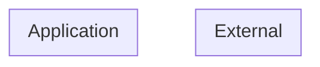

# Threat Model (auto-generated)

Generated by agentic-security on 2026-06-02.

This threat model is derived from static analysis of the current codebase and is regenerated on every scan. It is intended as a working artifact, not a finished compliance document.

## Entities + boundaries

## Assets

## STRIDE threats

### Tampering (2)

- [high] **weak-rng** (CWE-338) at `internal/pki/issue.go:42` — Insecure Randomness — math/rand (non-crypto) used for security-sensitive value
- [medium] **timing-attack** (CWE-208) at `internal/server/server.go:88` — Timing-Unsafe Comparison — secret/HMAC compared with === instead of timingSafeEqual

### Information Disclosure (3)

- [high] **ssrf** (CWE-918) at `internal/agent/sync/client.go:43` — SSRF — http.NewRequest with variable URL
- [medium] **pqc-migration** (CWE-327) at `internal/pki/issue.go:37` — Pre-quantum RSA (rsa-sign) — replace with ML-DSA-65 before CRQC arrives
- [medium] **pqc-migration** (CWE-327) at `internal/pki/issue.go:6` — Pre-quantum RSA (rsa-sign) — replace with ML-DSA-65 before CRQC arrives

### Elevation of Privilege (1)

- [high] **ssrf** (CWE-918) at `internal/agent/sync/client.go:43` — SSRF — http.NewRequest with variable URL

## Attack trees
