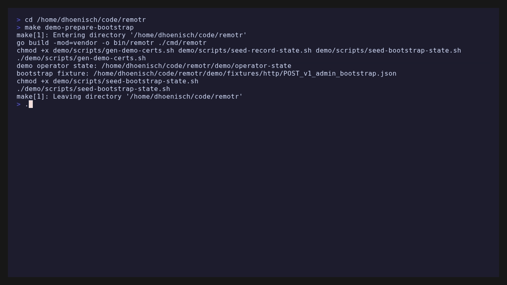
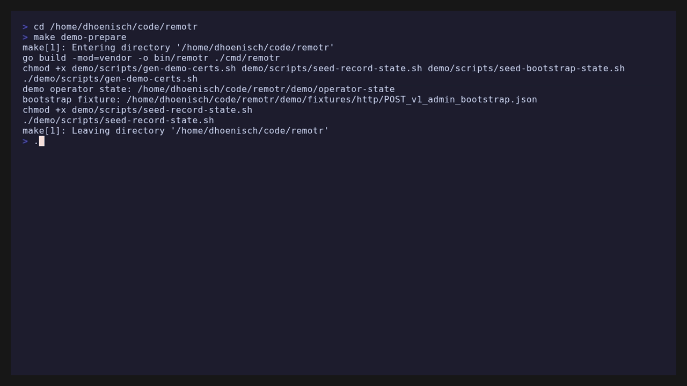
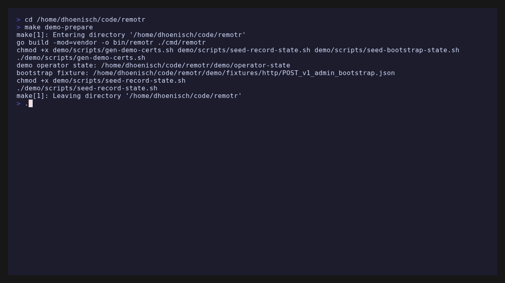
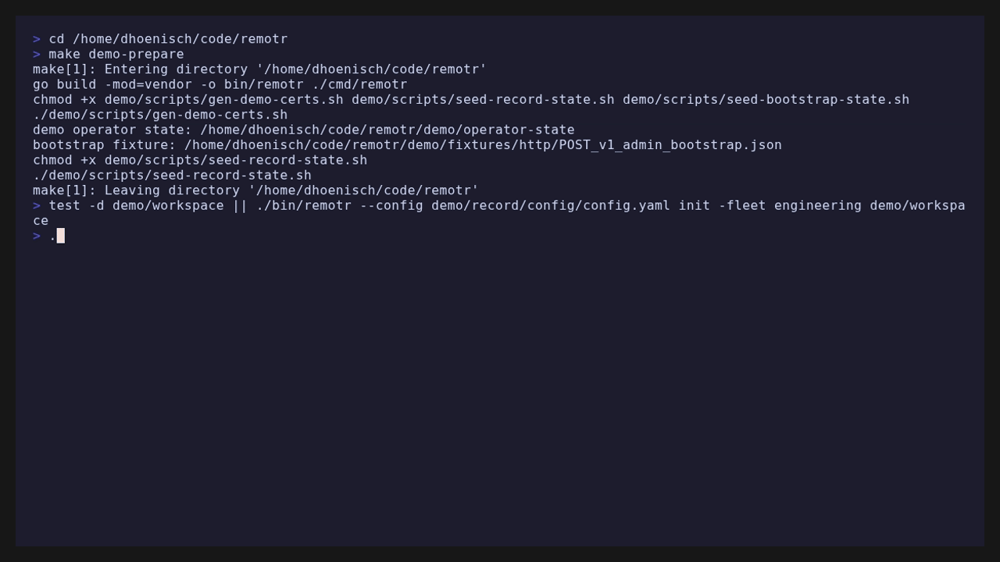

# Operator workflows

The `remotr` binary is the **Admin CLI**. Operators change desired state through Git (the configuration repository). Server registry operations — bootstrap, enrollment tokens, endpoint inventory — go through the Admin CLI over mTLS using **operator credentials**, not endpoint credentials.

There is no web UI in v1.

Terminal recordings below use [demo mode](../../reference/environment-variables.md#demo-mode-and-vhs-recordings) (`REMOTR_DEMO`): fixture data and a fictional server URL, not a live deployment.

## Credential model

| Credential | Purpose | Stored on |
|------------|---------|-----------|
| Operator bootstrap token | One-time; creates first operator | Server stdout + `REMOTR_BOOTSTRAP_FILE` |
| Operator credential | Admin API (`/v1/admin/*`) | `~/.config/remotr/` or `REMOTR_OPERATOR_STATE_DIR` |
| Enrollment token | One-time; binds endpoint to fleet | Created by operator; delivered to installer |
| Endpoint credential | Ongoing sync (`/v1/sync`) | Agent `/var/lib/remotr/` |

All TLS identities are issued by the **Remotr CA** (`REMOTR_CA_CERT` / `REMOTR_CA_KEY` on the server).

## Bootstrap the first operator

When the server starts with Postgres and no registered operators, it generates a bootstrap token.

1. Read the token from server logs or the bootstrap file (default `/var/lib/remotr/bootstrap.token` on the server host).
2. Exchange it:

```bash
remotr bootstrap \
  --server-url https://remotr.example:8443 \
  --ca /etc/remotr/ca.crt \
  --token "$BOOTSTRAP_TOKEN" \
  --state-dir ~/.config/remotr
```



3. Confirm credentials exist:

```bash
ls ~/.config/remotr/
# operator.crt  operator.key  ca.crt  state.json
```

The bootstrap token and file are invalidated after a successful exchange. Issue additional operator credentials with `remotr admin credential stamp` (see [Audit logging and SIEM export](#audit-logging-and-siem-export)).

## Create enrollment tokens

Each new machine needs a one-time enrollment token tied to a **fleet**:

```bash
remotr enroll token create \
  --server-url https://remotr.example:8443 \
  --fleet engineering \
  --ttl 168h \
  --state-dir ~/.config/remotr
```


Output includes the token string and expiry. Deliver the token securely to whoever installs the agent (SSH session, secrets manager, or short-lived file on a provisioning USB).

Tokens are consumed at enroll and cannot be reused.

### Deployment tokens (bulk / long-lived install)

For many machines or scripted provisioning, create a **deployment token** (reusable until expiry or revoke):

```bash
remotr deployment create --label prod-laptops-2026 --fleet production --ttl 8760h --out /secure/deploy.token
```



Send installers a single command (CA is fetched from the server; it is public):

```bash
REMOTR_YES=1 \
REMOTR_SERVER_URL=https://remotr.example:8443 \
REMOTR_DEPLOYMENT_TOKEN='paste-token-here' \
bash <(curl -fsSL https://raw.githubusercontent.com/DavidHoenisch/remotr/master/scripts/install-agent.sh)
```

See [Installing the agent](installing-agent.md) for the full install-script reference (CA auto-fetch, environment variables, fingerprint pin).

### Register a fleet before enrolling

Fleets must exist in Postgres `fleet_settings` (remediation policy) before enrollment tokens work.

**Option A — scaffold with registration:**

```bash
export REMOTR_DATABASE_URL='postgres://...'
remotr init ./remotr-config \
  -fleet engineering \
  -policy auto \
  --register-server \
  --enroll \
  --enroll-out /secure/enroll.token
```

**Option B — SQL (when adding a fleet manually):**

```sql
INSERT INTO fleet_settings (fleet, remediation_policy)
VALUES ('engineering', 'auto')
ON CONFLICT (fleet) DO NOTHING;
```

Remediation policy values:

- `auto` (default) — agent applies changes when drift is detected on sync
- `report` — agent reports drift only; no mutation until policy changes or an operator intervenes

## List and inspect endpoints

Human-readable list:

```bash
remotr endpoint list --server-url https://remotr.example:8443
```


JSON for scripts:

```bash
remotr endpoint list --server-url https://remotr.example:8443 --json
```

Show one endpoint (labels, drift, apply failures, agent upgrade status):

```bash
remotr endpoint show <endpoint-id>
remotr endpoint show <endpoint-id> --json
```



Endpoint id may appear before flags (`remotr endpoint show phalanx --server-url ...`).

### Request in-band agent upgrades

Taint endpoints so the next sync delivers an `agentUpgrade` instruction (see [Agent deployment](agent-deployment.md#agent-upgrades)):

```bash
# All endpoints in a fleet
remotr fleet agent upgrade --fleet engineering --version v0.1.15

# Single endpoint
remotr endpoint agent upgrade <endpoint-id> --version v0.1.15
```

Monitor with `remotr endpoint show <id>`. Agents must run v0.1.15+ for reliable self-upgrade.

### Remove a decommissioned endpoint

Unregister an endpoint from the server (stops accepting its mTLS identity). This does not uninstall the agent on the host — stop `remotr-agent.service` there separately.

```bash
remotr endpoint remove --server-url https://remotr.example:8443 <endpoint-id>
```

After removal, sync from that machine fails with **unknown endpoint** until it is re-enrolled. Remove any `endpoints/<id>/desired.yaml` override from the configuration repository in a normal Git change.

### Labels

Endpoints report **labels** in the sync request body (for example `site=berlin`, `role=web`). Labels appear in admin queries; v1 does **not** use labels to select configuration paths. Assignment is fleet enrollment plus optional `endpoints/<id>/desired.yaml` override only.

## Publish configuration changes

Desired state changes never go through the Admin CLI. Workflow:

1. Edit `fleets/<fleet>/desired.yaml` (or an endpoint override) in the configuration repository.
2. Open a pull request; review in Git as usual.
3. Merge to the tracked branch (for example `main`).
4. Git sync advances the **release ref** on the server (webhook or poll).
5. Agents pick up the new artifact digest on the next sync.

See [Configuration repository](configuration-repository.md) for layout and override semantics.

## Git sync and release ref

The server serves artifacts from a checkout at `REMOTR_CONFIG_REPO`. The **release ref** is the Git commit SHA agents receive with each artifact.

Configure Git sync on the server:

| Variable | Purpose |
|----------|---------|
| `REMOTR_GIT_REMOTE_URL` | Remote to fetch (HTTPS URL without embedded credentials) |
| `REMOTR_GIT_TOKEN` | GitHub/Git HTTPS PAT for private repos |
| `REMOTR_GIT_USERNAME` | HTTPS username (default `x-access-token` for GitHub) |
| `REMOTR_GIT_BRANCH` | Branch to track (default `main`) |
| `REMOTR_GIT_SYNC_POLL_INTERVAL` | Periodic fetch (for example `5m`); `0` disables polling |
| `REMOTR_GIT_WEBHOOK_SECRET` | Shared secret for `X-Remotr-Git-Webhook-Secret` header |

Webhook endpoints:

- `/v1/webhooks/git` — for GitHub/forge hooks (requires `X-Remotr-Git-Webhook-Secret` when configured)
- `/v1/admin/git-sync` — operator mTLS (use `remotr git sync`)

Example forge hook (GitHub webhook):

```bash
curl -X POST https://remotr.example:8443/v1/webhooks/git \
  -H "X-Remotr-Git-Webhook-Secret: $SECRET"
```

Trigger sync manually as an operator:

```bash
remotr git sync
```


### Private GitHub repositories

Set a **read-only** GitHub PAT on the server (Fly secret, systemd env, etc.):

```bash
fly secrets set \
  REMOTR_GIT_REMOTE_URL=https://github.com/your-org/remotr-config.git \
  REMOTR_GIT_TOKEN=ghp_xxxxxxxx \
  REMOTR_GIT_BRANCH=main \
  -a your-app
```

On first sync the server clones (or replaces a bundled starter checkout) from the private remote. The PAT is passed via Git `http.extraHeader` and is **not** written to `.git/config`.

Use a fine-grained PAT or classic token with **Contents: read** on the config repo only.

If the config repo is not a Git checkout (plain directory mount), set `REMOTR_RELEASE_REF` to a static label; the server will not advance ref automatically.

## Role-based access control

When Postgres is enabled, operator API access is governed by RBAC roles in addition to mTLS.

### Built-in roles

| Role | Typical use |
|------|-------------|
| `global_admin` | First bootstrap operator; full administrative access |
| `read_only` | Monitoring dashboards, inventory review |
| `security_logger` | SIEM collectors and audit review automation |

The bootstrap operator automatically receives `global_admin`.

### Issue a read-only operator

```bash
remotr admin credential stamp \
  --label monitoring \
  --role read_only \
  --out ./monitoring-creds
```

### Manage roles and assignments

```bash
remotr rbac role-list
remotr rbac role-create fleet_observer --description "Endpoint inventory only"
remotr rbac rule-add fleet_observer --method GET --path /v1/admin/endpoints/*
remotr rbac operator-list
remotr rbac operator-set-roles <operator-id> --role read_only --role fleet_observer
```

Custom roles make it straightforward to add new access patterns without pulling in an external authorization library.

## Audit logging and SIEM export

When the server uses Postgres, every `/v1/*` API call is persisted as a structured audit event (action, actor, HTTP metadata, optional resource details). Operators can review events from the CLI or export them to a SIEM.

### View recent events

```bash
remotr logs list --since 24h
remotr logs list --since 24h --action admin.endpoint.delete --json
```

Paginate with the `next_cursor` value from JSON output:

```bash
remotr logs list --since 24h --cursor "$CURSOR"
```

### Provision a SIEM collector credential

Export endpoints require mTLS. Create a dedicated operator credential for the collector host (do not copy your interactive operator cert):

```bash
remotr admin credential stamp \
  --label siem-collector \
  --role security_logger \
  --out /etc/remotr-siem
# writes cert.pem, key.pem, ca.pem
```

### Discover the export URL

The export path includes a per-server random key (defense in depth, similar to a webhook URL):

```bash
remotr logs export-info
# export path: /v1/exports/audit/<path_key>
```

### Pull events into a SIEM

Example collector script (last 24 hours, paginated):

```bash
#!/usr/bin/env bash
set -euo pipefail

SERVER_URL="https://remotr.example:8443"
CERT_DIR="/etc/remotr-siem"
PATH_KEY="$(remotr logs export-info --json | jq -r .path_key)"
SINCE="$(date -u -d '24 hours ago' +%Y-%m-%dT%H:%M:%SZ)"
CURSOR=""

while true; do
  URL="${SERVER_URL}/v1/exports/audit/${PATH_KEY}?since=${SINCE}&limit=500"
  if [[ -n "${CURSOR}" ]]; then
    URL="${URL}&cursor=${CURSOR}"
  fi
  RESP="$(curl -fsS \
    --cert "${CERT_DIR}/cert.pem" \
    --key "${CERT_DIR}/key.pem" \
    --cacert "${CERT_DIR}/ca.pem" \
    "${URL}")"
  echo "${RESP}" | jq -c '.events[]' >> /var/log/remotr-audit.ndjson
  CURSOR="$(echo "${RESP}" | jq -r '.next_cursor // empty')"
  [[ -z "${CURSOR}" ]] && break
done
```

Ship `/var/log/remotr-audit.ndjson` to your SIEM with your existing log forwarder.

See [HTTP API reference — Audit logging](../reference/http-api.md#audit-logging) for full query parameters and response fields.

## Certificate maintenance

See [CA rotation runbook](../runbooks/ca-rotation.md) for full CA rotation, endpoint re-enrollment, and operator cert replacement.

Quick endpoint cert refresh (CA unchanged):

```bash
remotr enroll token create --server-url ... --fleet engineering
# on endpoint:
remotr-agent enroll --token ... --force --server-url ... --ca ...
```

## Validate configuration before merge

Check a configuration repository locally (no server required):

```bash
remotr config validate ./remotr-config
remotr config validate --json
```



Reports schema and convention issues in fleet and endpoint artifacts.

## CLI layout

The operator CLI uses [urfave/cli](https://github.com/urfave/cli). Global flags apply to all subcommands:

```bash
remotr --help
remotr endpoint --help
remotr fleet agent upgrade --help
```

Common globals: `--config`, `--server-url`, `--state-dir`, `--ca`, `--fleet`. Precedence: **flags > environment > config file**.

## Environment summary

Operator credentials default to `~/.config/remotr/` (`REMOTR_OPERATOR_STATE_DIR` or `--state-dir`).

Server-side Postgres is required for bootstrap, enrollment tokens, drift telemetry, agent upgrade taints, audit logging, and dynamic release ref. See [Environment variables](../reference/environment-variables.md).
